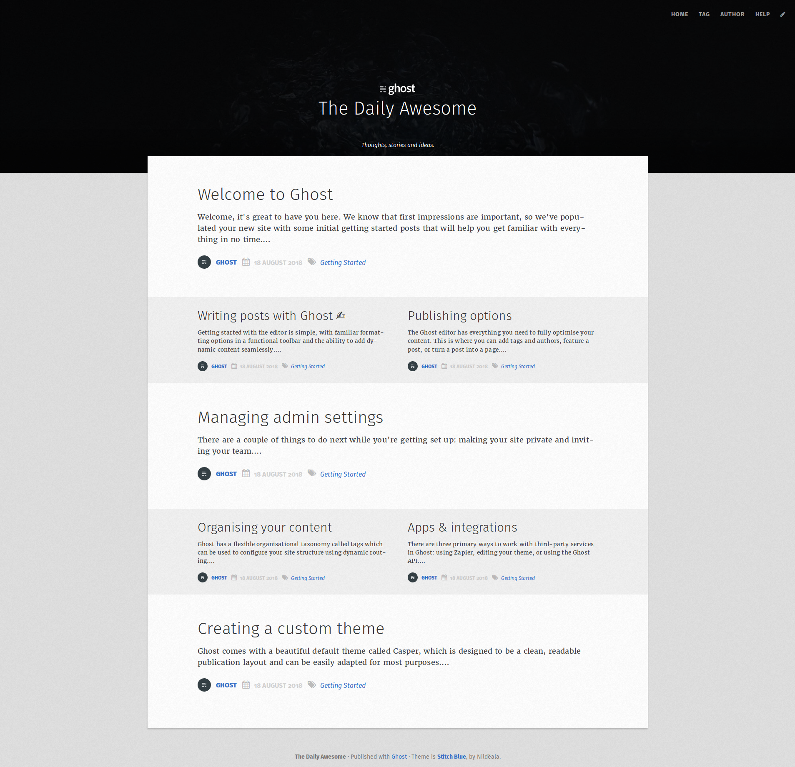
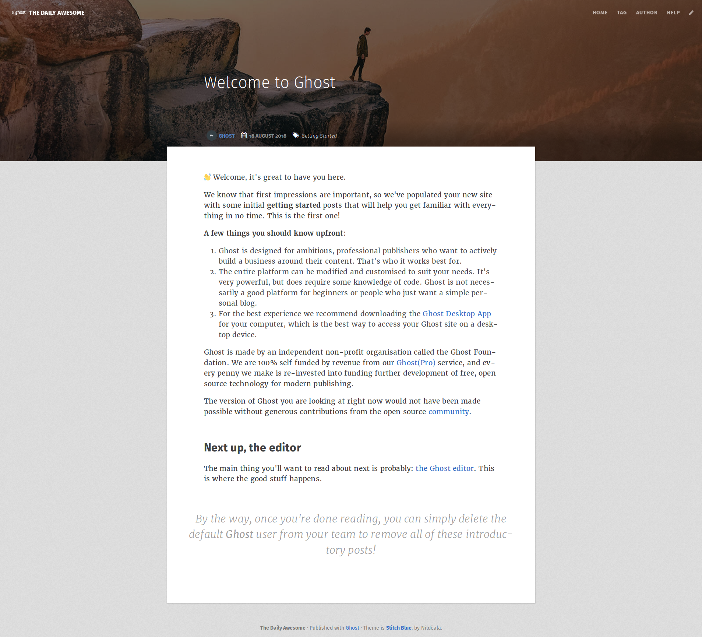
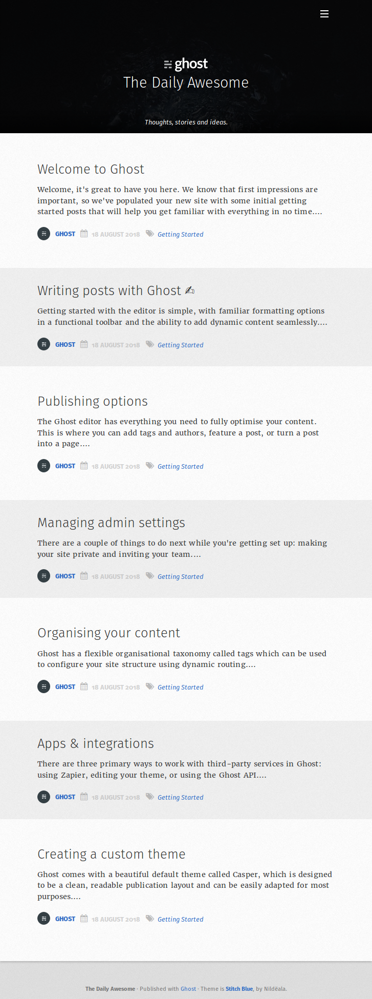
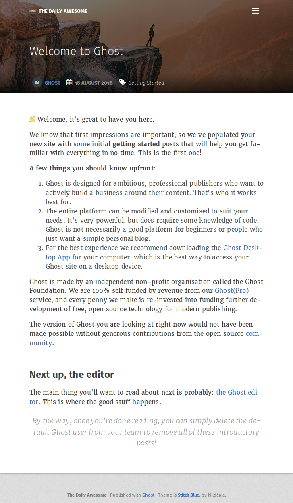

# Stitch Blue *for Ghost*
A nice and elegant theme for Ghost, inspired by the color Stitch blue.

*README is waiting to be redone*

## Some screenshots

* Homepage on desktop


* Some article on desktop


* Homepage on mobile


* Some article on mobile


## Search engine

This theme includes the [ghostHunter](https://github.com/jamalneufeld/ghostHunter) search engine on a dedicated page we handle with the [custom template](https://themes.ghost.org/docs/page-context) `page-search.hbs`. You either need to create a [static page](https://help.ghost.org/hc/en-us/articles/224936867-Static-Pages) with the `search` slug or to move the file to a matching `page-:slug.hbs`.

To use ghostHunter, you need to create a **Custom Integration** and inject its **Content API key** into your blog header:

* Go to **Integrations**
* Choose **Add custom integration**, name it `ghostHunter` and choose **Create**. Copy the generated Content API Key.
* Go to **Code injection**
* Add this to **Blog Header**:
```txt
<script>
  var ghosthunter_key = 'PASTE_THE_GENERATED_KEY_HERE';
</script>
```
